<p align="center"></a></p>

**<p align="center">Give Vaccine Kill Covid</p>**

<a href="https://play.google.com/store/apps/details?id=com.sujith.covi_kill">
<p align="center">

</p>
</a>

## **Introduction 👨‍💻**
In the initial stages of covid-19 vaccine testing trails, doctors are testing with many vaccines for discovering a cure for covid-19, at that stage it became difficult for the doctors to give a proper vaccine to their patients. So taking this part as an inspiration to provide a vaccine to their patient in difficulit situations. Covi Kill is a simple interactive game which is available in Android, Web, Linux made using flutter.  

## **What it does 😎**
In this game, doctor avatar need to play 5 levels to complete the whole game, as the levels increases the game hardness increases. The Doctor need to take the vaccine to the covid-19 effected patients, and cure them. There are some covid-19 patients, the doctor need to give them the vaccine to that patient, so by delivering the vaccine to the patient he will be cured.


## **Built using 💻**
<a href="https://raw.githubusercontent.com/Codelessly/ResponsiveFramework/master/packages/Flutter%20Logo%20Banner.png">
  
</a>
<a href="https://github.com/Codelessly/ResponsiveFramework">
  
</a>
<a href="https://rive.app">
  
</a>

-----------

## **Getting Started 🏃‍♂️️**

- These instructions will get you a copy of the project up and be running on your local machine for development and testing purposes.

## **Prerequisites ✍️**

-  [Android Studio](https://developer.android.com/studio), with a recent version of the Android SDK.
- [Flutter](https://flutter.dev/)
## **Setting up your development environment 🏭️**

1. Download and install Git.
   
2. Fork [Covi kill](https://github.com/bolisettysujith/covi-kill.git)
   
3. Clone your fork of the project locally. At the command line:
            
   ```
   $ git clone https://github.com/YOUR-GITHUB-USERNAME/covi-kill.git
   ```

4. Open Covi Kill in your favourite editor (VS Code, Android Studio etc)
   
5. To install the dependencies run the following command in the terminal.

    ```
    $ flutter pub get
    ```

6.  Connect your Android emulator or your mobile device to your computer.
   
7.  Build the application in your device by clicking **Run**  button or run the following in terminal.
    ```
    $ flutter run
    ```


## **Instructions 📖**
- The game contains 5 Levels🎚️, so you need to complete all the levels to complete the game.
- To move the avatar use the Arrow Keys or the Swipe Gestures or the Joy Sticks 🎮.
- Push the syringe vaccine 💉 to the patient, if both patient and vaccine merges u have completed vaccinating on patient, so the same for the rest of the patients.
- Use the flag 🏴 Icon to give up the game.
- Use the restart 🔄 Icon to restart the game.
- Use the settings Icon ⚙️ to change the game settings.
  > Disable/Enable the sound effects 🔊.

  > Disable/Enable the Vibration 📳.
  
  > Disable/Enable the Joy Sticks 🎮. 

## **Mobile View 📱**
  <table>
       <tr>
       <td align="center">Home Page</td>
       <td align="center">Levels Page</td>
       <td align="center">Settings Page</td>
      </tr>
       <tr>
       <td>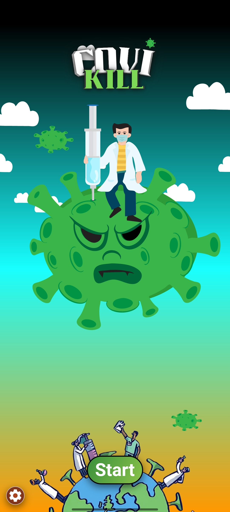</td>
       <td>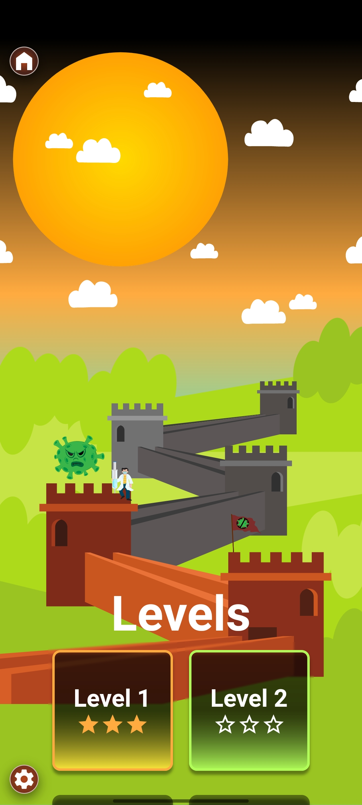</td>
       <td>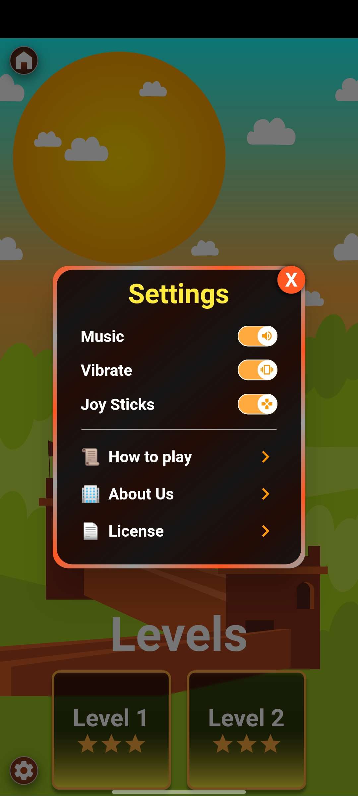</td>
      </tr>
       <tr>
       <td align="center">All Levels</td>
       <td align="center">Game Page</td>
       <td align="center">Vaccinating to Patients with No Joy Stick</td>
      </tr>
      <tr>
       <td></td>
       <td>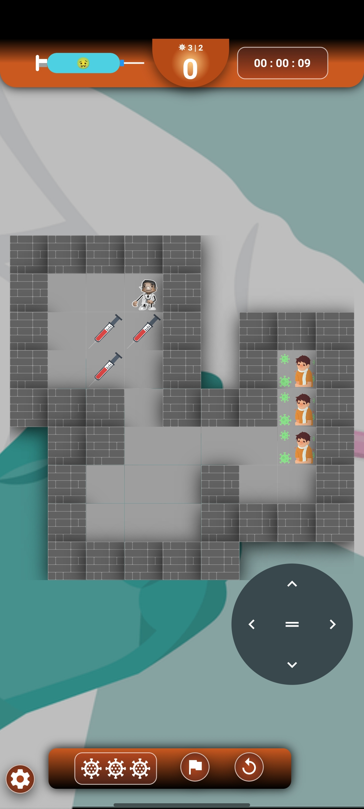</td>
       <td></td>
      </tr>
      <tr>
       <td align="center">Win Celebration</td>
       <td align="center">Level Completed Page</td>
       <td align="center">Level Lost Page</td>
      </tr>
      <tr>
       <td>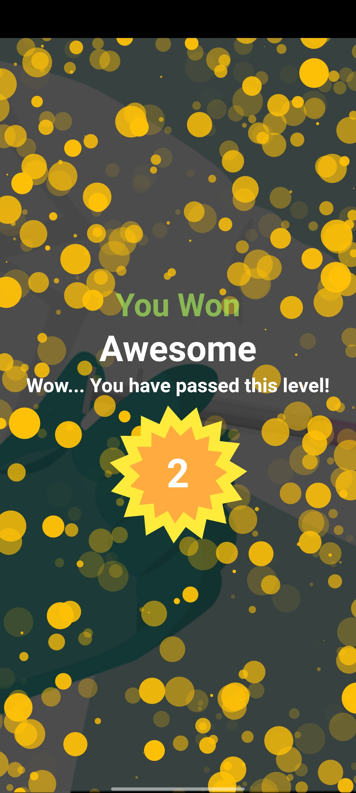</td>
       <td>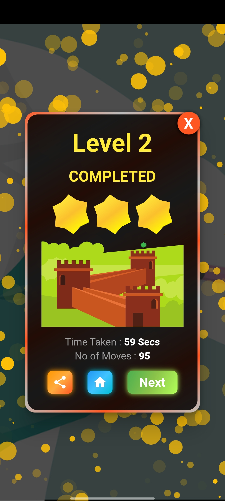</td>
       <td>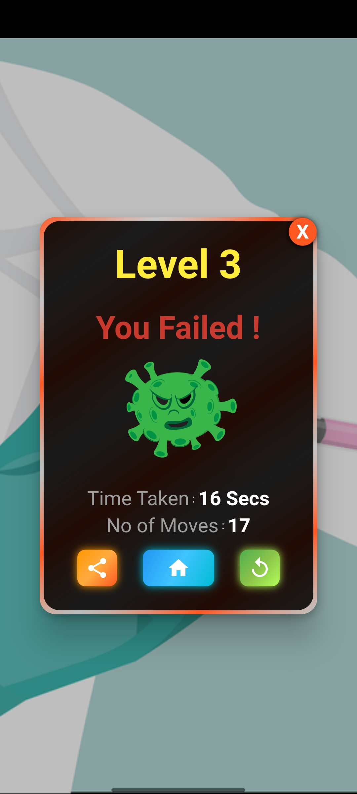</td>
      </tr>
  </table>


## **Desktop View 🖥️**
  <table>
      <tr>
       <td>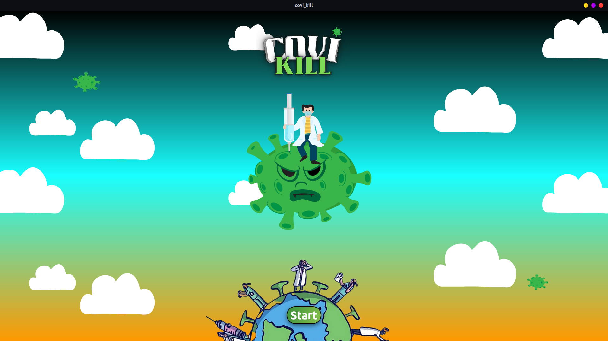</td>
       <td>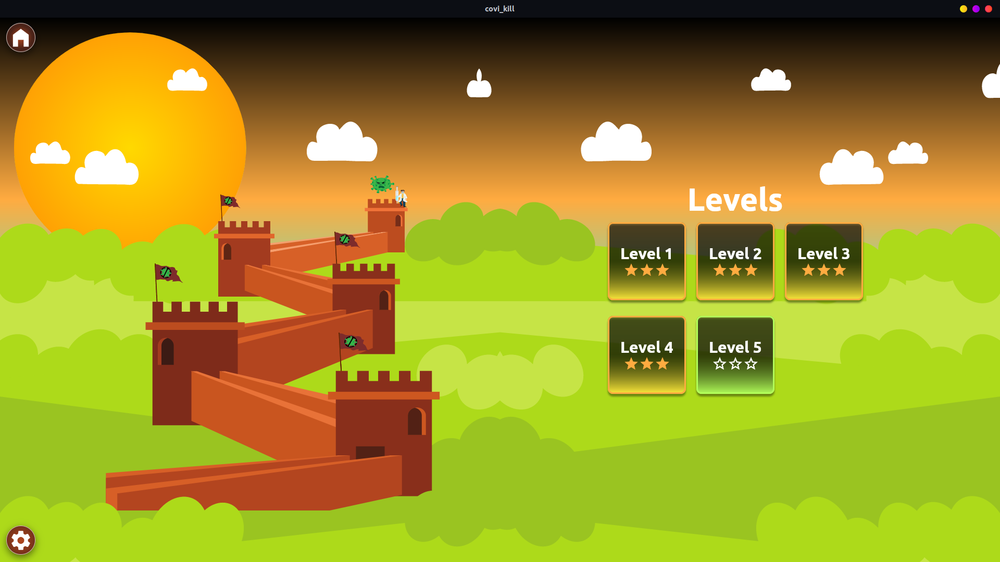</td>
      </tr>
  </table>
  <table>
       <tr>
       <td></td>
      </tr>
  </table>
  <table>
       <tr>
       <td>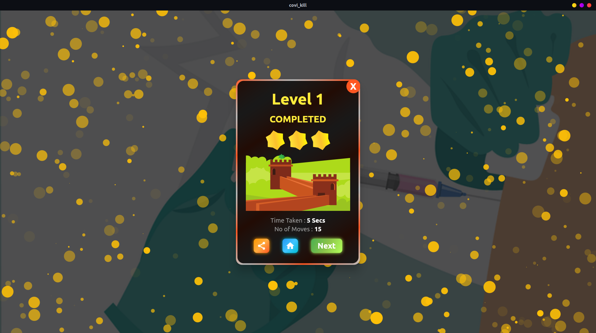</td>
       <td>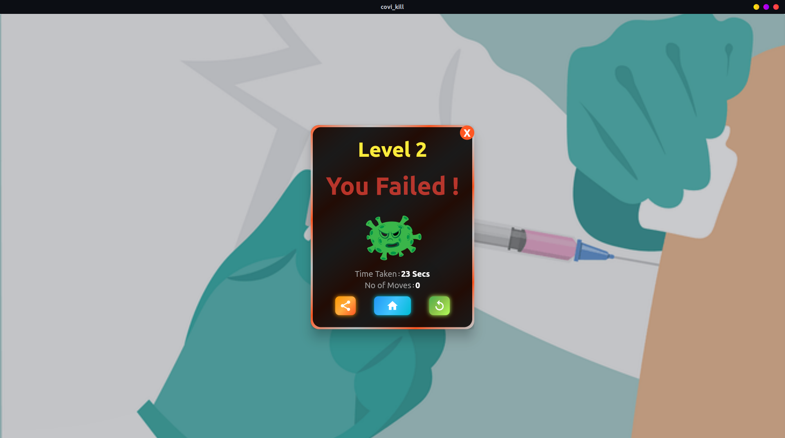</td>
      </tr>
  </table>


### **&ensp;Try out the game from 📥** : [**Play Store**](https://play.google.com/store/apps/details?id=com.sujith.covi_kill)

*<p align="center">Show some support by **⭐ing** the repository 😇</p>*

**<p align="center">Happy Coding 😎</p>**
