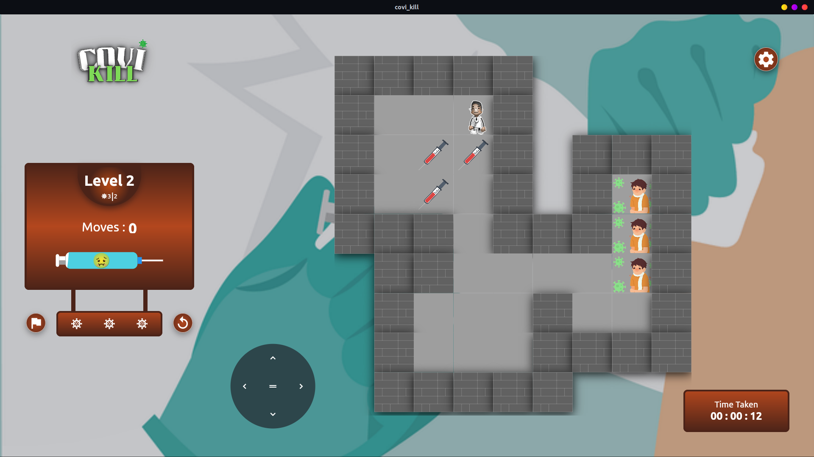

<p align="center"></a></p>

**<p align="center">Give Vaccine Kill Covid</p>**

# **Introduction**👨‍💻
In the initial stages of covid-19 vaccine testing trails, doctors are testing with many vaccines for discovering a cure for covid-19, at that stage it became difficult for the doctors to give a proper vaccine to their patients. So taking this part as an inspiration to provide a vaccine to their patient in difficulit situations. Covi Kill is a simple interactive game which is available in Android, Web, Linux made using flutter.  

# **What it does**😎
In this game, doctor avatar need to play 5 levels to complete the whole game, as the levels increases the game hardness increases. The Doctor need to take the vaccine to the covid-19 effected patients, and cure them. There are some covid-19 patients, the doctor need to give them the vaccine to that patient, so by delivering the vaccine to the patient he will be cured.


# **Built using**💻
<a href="https://raw.githubusercontent.com/Codelessly/ResponsiveFramework/master/packages/Flutter%20Logo%20Banner.png">
  
</a>
<a href="https://github.com/Codelessly/ResponsiveFramework">
  
</a>
<a href="https://rive.app">
  
</a>

-----------

## **Challenges I ran into**🤔
It was the first time to Build an responsive app, so it was Challenging to build an app like this.

## **Accomplishments that I'm proud of**😁
I really proud of building an app like this which is responsive with many more other awsome features and it teached me a lot of lessons while building this app.

## **What I have learned**😎
App State management is the biggest thing that I have learned while building this app, and learned creating animations using canvas as well as in Rive. The another biggest thing that I have learned is creating responsive apps. This app also made me learn many dart concepts and building some super cool logics which make the UI more iteractive.

## **What's next for Covi Kill** 🙃
At present this app is having 5 levels, so planning to extend the levels.


## **Getting Started 🏃‍♂️️**

- These instructions will get you a copy of the project up and be running on your local machine for development and testing purposes.

## **Prerequisites ✍️**

-  [Android Studio](https://developer.android.com/studio), with a recent version of the Android SDK.
- [Flutter](https://flutter.dev/)
## **Setting up your development environment 🏭️**

1. Download and install Git.
   
2. Fork [Covi kill](https://github.com/bolisettysujith/covi-kill.git)
   
3. Clone your fork of the project locally. At the command line:
            
   ```
   $ git clone https://github.com/YOUR-GITHUB-USERNAME/covi-kil.git
   ```

4. Open Raag in your favourite editor (VS Code, Android Studio etc)
   
5. To install the dependencies run the following command in the terminal.

    ```
    $ flutter pub get
    ```

6.  Connect your Android emulator or your mobile device to your computer.
   
7.  Build the application in your device by clicking **Run**  button or run the following in terminal.
    ```
    $ flutter run
    ```

## **Instructions 📖**
- The game contains 5 Levels🎚️, so you need to complete all the levels to complete the game.
- To move the avatar use the Arrow Keys or the Swipe Gestures or the Joy Sticks 🎮.
- Push the syringe vaccine 💉 to the patient, if both patient and vaccine merges u have completed vaccinating on patient, so the same for the rest of the patients.
- Use the flag 🏴 Icon to give up the game.
- Use the restart 🔄 Icon to restart the game.
- Use the settings Icon ⚙️ to change the game settings.
  > Disable/Enable the sound effects 🔊.

  > Disable/Enable the Vibration 📳.
  
  > Disable/Enable the Joy Sticks 🎮. 


## Screenshots 🤩️
  <table>
      <tr>
       <td></td>
       <td></td>
      </tr>
  </table>
  <table>
       <tr>
       <td></td>
      </tr>
  </table>
  <table>
       <tr>
       <td></td>
       <td></td>
      </tr>
  </table>

### 📺&ensp;Watch Demo Video : [YouTube](https://www.youtube.com/watch?v=2h1yZARPC5U "Covi Kill")

### 📥&ensp;Try out the game from [here](https://appetize.io/app/bfa1z1krdzzyb2006426ky0k44)

*<p align="center">Show some support by **⭐ing** the repository 😇</p>*
